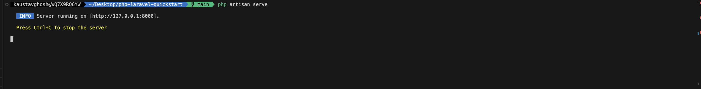
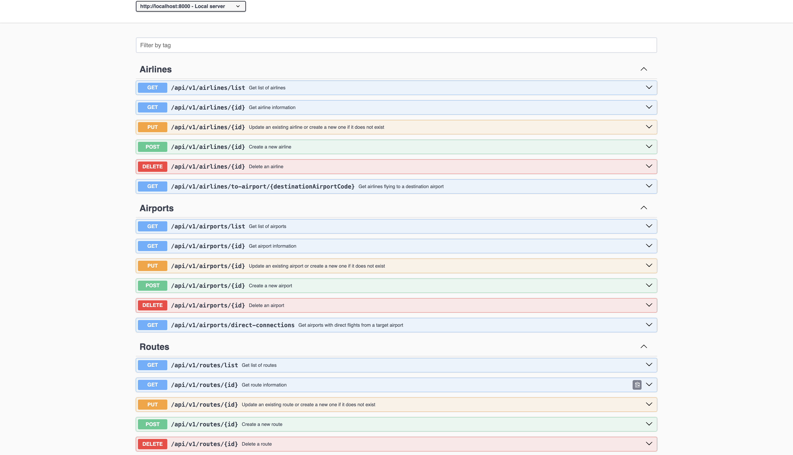
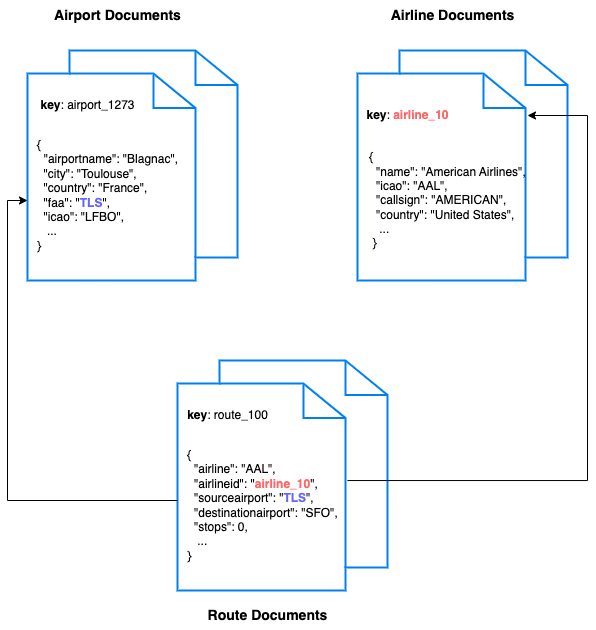

# Quickstart in Couchbase with PHP using Laravel

## REST API using Couchbase Capella in PHP using Laravel

Often, the first step developers take after creating their database is to create a REST API that can perform Create, Read, Update, and Delete (CRUD) operations for that database. This repo is designed to teach you and give you a starter project (in PHP using Laravel) to generate such a REST API. After you have installed the travel-sample bucket in your database, you can run this application which is a REST API with Swagger documentation so that you can learn:

1. How to create, read, update, and delete documents using Key-Value[operations](https://docs.couchbase.com/php-sdk/current/howtos/kv-operations.html) (KV operations). KV operations are unique to Couchbase and provide super fast (think microseconds) queries.
2. How to write simple parametrized [N1QL queries](https://docs.couchbase.com/php-sdk/current/howtos/n1ql-queries-with-sdk.html) using the built-in travel-sample bucket.

Full documentation for the tutorial can be found on the [Couchbase Developer Portal](https://developer.couchbase.com/tutorial-quickstart-laravel-php/).

## Prerequisites

To run this prebuilt project, you will need:

- [Couchbase Capella](https://www.couchbase.com/products/capella/) cluster with [travel-sample](https://docs.couchbase.com/php-sdk/current/ref/travel-app-data-model.html) bucket loaded.
  - To run this tutorial using a self-managed Couchbase cluster, please refer to the [appendix](#running-self-managed-couchbase-cluster).
- [PHP](https://www.php.net/downloads.php) 8.2 or higher installed
  - Ensure that the PHP version is [compatible](https://docs.couchbase.com/php-sdk/current/project-docs/compatibility.html#php-version-compat) with the Couchbase SDK.
- Loading Travel Sample Bucket
  If travel-sample is not loaded in your Capella cluster, you can load it by following the instructions for your Capella Cluster:
  - [Load travel-sample bucket in Couchbase Capella](https://docs.couchbase.com/cloud/clusters/data-service/import-data-documents.html#import-sample-data)

## App Setup

We will walk through the different steps required to get the application running.

### Cloning Repo

```shell
git clone https://github.com/couchbase-examples/php-laravel-quickstart.git
```

### Install Dependencies

The dependencies for the application are specified in the `composer.json` file in the root folder. Dependencies can be installed using [Composer](https://getcomposer.org/), the default package manager for PHP.

```sh
composer install
```

### Initial Configuration

After installing dependencies, you need to set up the basic Laravel configuration:

1. Create the environment file:

```sh
cp .env.example .env
```

2. Generate application key:

```sh
php artisan key:generate
```

3. Create the database and run the migrations:

```sh
mkdir -p database && touch database/database.sqlite && php artisan migrate
```

4. Generate Swagger documentation:

```sh
php artisan l5-swagger:generate
```

### Setup Database Configuration

To learn more about connecting to your Capella cluster, please follow the [instructions](https://docs.couchbase.com/cloud/get-started/connect.html).

Specifically, you need to do the following:

- Create the [database credentials](https://docs.couchbase.com/cloud/clusters/manage-database-users.html) to access the travel-sample bucket (Read and Write) used in the application.
- [Allow access](https://docs.couchbase.com/cloud/clusters/allow-ip-address.html) to the Cluster from the IP on which the application is running.

All configuration for communication with the database is read from the environment variables. We have provided a convenience feature in this quickstart to read the environment variables from a local file, `config/couchbase.php`.

> Note: Set the values for the Couchbase connection in the `config/couchbase.php` file. This file is used to store sensitive information and should not be checked into version control.

```php
<?php
return [
    'host' => env('DB_CONN_STR', 'couchbase://127.0.0.1'),
    'username' => env('DB_USERNAME', 'Administrator'),
    'password' => env('DB_PASSWORD', 'password'),
    'bucket' => env('DB_BUCKET', 'travel-sample'),
];
```

> Note: The connection string expects the `couchbases://` or `couchbase://` part.

## Running The Application

### Directly on Machine

At this point, we have installed the dependencies, loaded the travel-sample data and configured the application with the credentials. The application is now ready and you can run it.

```sh
php artisan serve
```

### Using Docker

- Build the Docker image

```sh
docker build -t couchbase-laravel-quickstart .
```

- Run the Docker image

```sh
docker run -p 8000:8000 couchbase-laravel-quickstart
```

> Note: The `config/couchbase.php` file has the connection information to connect to your Capella cluster. These will be part of the environment variables in the Docker container.

### Verifying the Application

Once the application starts, you can see the details of the application on the logs.



The application will run on port 8000 of your local machine ([http://localhost:8000/api/documentation](http://localhost:8000/api/documentation)). You will find the Swagger documentation of the API if you go to the URL in your browser. Swagger documentation is used in this demo to showcase the different API endpoints and how they can be invoked. More details on the Swagger documentation can be found in the [appendix](#swagger-documentation).



## Running Tests

To run the integration tests, use the following commands:

```sh
php artisan test
```

## Appendix

### Data Model

For this quickstart, we use three collections, `airport`, `airline` and `routes` that contain sample airports, airlines and airline routes respectively. The routes collection connects the airports and airlines as seen in the figure below. We use these connections in the quickstart to generate airports that are directly connected and airlines connecting to a destination airport. Note that these are just examples to highlight how you can use N1QL queries to join the collections.



### Extending API by Adding New Entity

If you would like to add another entity to the APIs, follow these steps:

- **Create the new entity (collection) in the Couchbase bucket:** You can create the collection using the [SDK](https://docs.couchbase.com/php-sdk/current/howtos/provisioning-cluster-resources.html#collection-management) or via the [Couchbase Server interface](https://docs.couchbase.com/cloud/n1ql/n1ql-language-reference/createcollection.html).

- **Define the model:** Create a new model in the `app/Models` directory, similar to the existing `Airline` model. For example, you can create a file `Hotel.php`:

```php
namespace App\Models;

use Illuminate\Database\Eloquent\Model;

class Hotel extends Model
{
    protected $bucket;

    protected $fillable = [
        'name',
        'address',
        'city',
        'country',
        'stars'
    ];

    public function __construct(array $attributes = [])
    {
        parent::__construct($attributes);
        $this->bucket = app('couchbase.bucket');
    }

    // Add methods for querying, saving, and deleting Hotel data
}
```

- **Define the controller:** Create a new controller in the `app/Http/Controllers` directory, similar to the existing `AirlineController`. For example, you can create a file `HotelController.php`:

```php
namespace App\Http\Controllers;

use Illuminate\Http\Request;
use App\Models\Hotel;

class HotelController extends Controller
{
    // Add methods for handling HTTP requests for the Hotel entity
}
```

- **Define the routes:** In the `routes/api.php` file, define the routes for the new entity similar to the existing routes for airlines:

```php
Route::prefix('v1/hotels')->group(function () {
    Route::get('list', 'HotelController@index');
    Route::get('{id}', 'HotelController@show');
    Route::post('{id}', 'HotelController@store');
    Route::put('{id}', 'HotelController@update');
    Route::delete('{id}', 'HotelController@destroy');
});
```

- **Integration tests:** Create a new test class in the `tests/Feature` directory, similar to the existing tests. For example, you can create a file `HotelIntegrationTest.php`:

```php
namespace Tests\Feature;

use Tests\TestCase;

class HotelIntegrationTest extends TestCase
{
    // Add test methods for the Hotel endpoints
}
```

### Running Self Managed Couchbase Cluster

If you are running this quickstart with a self-managed Couchbase cluster, you need to [load](https://docs.couchbase.com/server/current/manage/manage-settings/install-sample-buckets.html) the travel-sample data bucket in your cluster and generate the credentials for the bucket.

You need to update the connection string and the credentials in the `config/couchbase.php` file:

```php
<?php
return [
    'host' => env('DB_CONN_STR', 'couchbase://<your-couchbase-server>'),
    'username' => env('DB_USERNAME', '<your-username>'),
    'password' => env('DB_PASSWORD', '<your-password>'),
    'bucket' => env('DB_BUCKET', 'travel-sample'),
];
```

Replace `<your-couchbase-server>`, `<your-username>`, and `<your-password>` with your actual Couchbase server details and credentials.

> **NOTE:** Couchbase must be installed and running prior to running the Laravel application.

### Swagger Documentation

Swagger documentation provides a clear view of the API including endpoints, HTTP methods, request parameters, and response objects.

Click on an individual endpoint to expand it and see detailed information. This includes the endpoint's description, possible response status codes, and the request parameters it accepts.

#### Trying Out the API

You can try out an API by clicking on the "Try it out" button next to the endpoints.

- Parameters: If an endpoint requires parameters, Swagger UI provides input boxes for you to fill in. This could include path parameters, query strings, headers, or the body of a POST/PUT request.

- Execution: Once you've inputted all the necessary parameters, you can click the "Execute" button to make a live API call. Swagger UI will send the request to the API and display the response directly in the documentation. This includes the response code, response headers, and response body.

#### Models

Swagger documents the structure of request and response bodies using models. These models define the expected data structure using JSON schema and are extremely helpful in understanding what data to send and expect.
